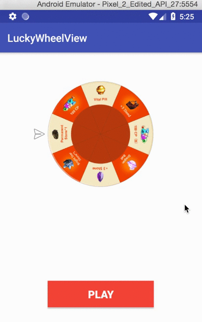

# Screenshot



# Usage

Include LuckyWheel widget in your layout:

```xml
<rubikstudio.library.LuckyWheelView
    android:layout_centerInParent="true"
    app:lkwBackgroundColor="#FF9800"
    app:lkwTextColor="#263238"
    app:lkwCenterImage="@drawable/wheel2"
    app:lkwCursor="@drawable/ic_cursor"
    android:id="@+id/luckyWheel"
    android:layout_width="300dp"
    android:layout_height="300dp" />
```

And in your code :

```java
LuckyWheelView luckyWheelView = (LuckyWheelView) findViewById(R.id.luckyWheel);
List<LuckyItem> data = new ArrayList<>();
for (int i=0; i<12; i++) {
    LuckyItem luckyItem = new LuckyItem();
    luckyItem1.text = "Item " + i;
    luckyItem1.icon = R.drawable.test;
    luckyItem1.color = 0xffFFF3E0;
    data.add(luckyItem);
}

luckyWheelView.setData(data);
luckyWheelView.setRound(10);

// start
luckyWheelView.startLuckyWheelWithTargetIndex(index);

// listener after finish lucky wheel
luckyWheelView.setLuckyRoundItemSelectedListener(new LuckyWheelView.LuckyRoundItemSelectedListener() {
    @Override
    public void LuckyRoundItemSelected(int index) {
        // do something with index
    }
});
```


# Cursor Animation

cursor Swinging small animation
```java
        // 200ms
        animCursor = ObjectAnimator.ofFloat(cursorView, "rotation", 0f, -30f, 0f);
        animCursor.setDuration(200);
        animCursor.setInterpolator(new AccelerateInterpolator());
        animCursor.setRepeatCount(0);
        animCursor.setRepeatMode(ValueAnimator.RESTART);
        
        // 設定cursor旋轉的中心點
        cursorView.setPivotX(0f);
        cursorView.setPivotY(cursorView.getWidth()/2);
```

Decelerate Interpolator to slow down the animation
```java
// 算角度，要轉幾圈（360度 * 圈數 - 目標角度）跟輪盤轉的角度一樣
        float targetAngle = 360f * SECOND_OF_ROUND - getAngleOfIndexTarget(targetIndex) ;

        // slow down
        animCursorSlowDown = ValueAnimator.ofFloat(0, targetAngle);
        // 10秒 1000=1秒
        animCursorSlowDown.setDuration(SECOND_OF_ROUND * 1000);
        animCursorSlowDown.setInterpolator(new DecelerateInterpolator());
        animCursorSlowDown.addUpdateListener(new ValueAnimator.AnimatorUpdateListener() {
            @Override
            public void onAnimationUpdate(final ValueAnimator animation) {
                // 目前的角度 + 一開始的偏移角度22.5
                float currentAngle = (float) animation.getAnimatedValue() + ((360f / GRID_OF_LUCKY_WHEEL) / 2);

                // 這次轉的角度
                float  angleOfThisTurn = currentAngle - preAngle;
                // 是否執行動畫
                int isStartAnimation = (int) (angleOfThisTurn / (360f / GRID_OF_LUCKY_WHEEL));

                if ( isStartAnimation > 0 && !animCursor.isRunning() ) {
                    Log.e("animCursor", "start()");
                    preAngle += isStartAnimation * (360f / GRID_OF_LUCKY_WHEEL);
                    animCursor.start();
                }
            }
        });
        animCursorSlowDown.addListener(new AnimatorListenerAdapter() {
            @Override
            public void onAnimationEnd(Animator animation) {
                preAngle = 0;
            }
        });

        if ( !animCursorSlowDown.isStarted() ) {
            animCursorSlowDown.start();
        }
```

#Custom LuckyWheel

You can setting these properties of the lucky wheel view with xml :
```xml
    app:lkwBackgroundColor="#FF9800"
    app:lkwTextColor="#263238"
    app:lkwCenterImage="@drawable/wheel2"
    app:lkwCursor="@drawable/ic_cursor"
```

Or with code like:
```java
    luckyWheelView.setLuckyWheelBackgrouldColor(0xff0000ff);
    luckyWheelView.setLuckyWheelTextColor(0xffcc0000);
    luckyWheelView.setLuckyWheelCenterImage(getResources().getDrawable(R.drawable.icon));
    luckyWheelView.setLuckyWheelCursorImage(R.drawable.ic_cursor);
```

#Sample
Check out the [sample application](https://github.com/thanhniencung/LuckyWheel/blob/master/app/src/main/java/com/ryan/luckywheel/MainActivity.java) to see it in action!

# Contributing
Contributions welcome via Github pull requests.


